# Paper Identification

|           |                      |
|-----------|----------------------|
| ID        |  |
| Author    |    |
| Title     |     |
| Iteration |     |

Some useful information up front:

-   [JPE Data and Code Availability Policy](https://www.journals.uchicago.edu/journals/jpe/datapolicy)
-   [Step by step guidance from Data Editor for Authors](https://jpedataeditor.github.io/)
-   [Template README](https://social-science-data-editors.github.io/template_README/)

# Summary

In assessing compliance with our [Data and Code Availability Policy](https://www.journals.uchicago.edu/journals/jpe/datapolicy), our reproducibility team has identified the following issues, which we ask you to address:

1. We were able to reproduce a large number of your exhibits. Still there are some remaining discrepancies. I am hoping that those are just updated tables in your paper (my replicator mused that you might by accident have sent the old version of the paper, tbc from your side). Table 2 columns 3 and 4 are quite different for us, so I need you to look into that.
2. We found a way to run your package from your precomupted results. I am giving you the task, using my replicator's outline below, to include in your readme, towards the beginning of the document, a precise outline of what we were able to run. Consequently, you should also list which parts we were *not* able to run. Your data availability statement in the JPE paper will eventually say something like "given the significant computational constraints, the JPE data editor verified only a subset of results, those are clearly indicated in the package readme". That's of course not a critique of your work in any way (if anything it's a critique of the fact that the JPE cannot provision the large scale compute that is required for your package, but that's another matter).
3. My plan is to wait for your reply via email, ideally in a pdf letter format, and then decide. My prior is that we don't need another round because you will be able to explain to me where those discprepancies come from.
4. Please add the {REQUIRED} items below to the readme. I had the impression that you had added the codebook as we discussed, if so, disregard that comment.
5. There are still a few missing data citations in the paper. All datasets must be cited in both paper and readme.

# General

-   [x] Data Availability and Provenance Statements
    -   [x] Statement about Rights - Part 1: Right to use the data (e.g. *did the authors lawfully obtain the data*)
    -   [x] Statement about Rights - Part 2: Right to publish the data (e.g. *are human subjects involved and did permission been granted to publish their data?*)
    -   [ ] License for Data (optional, but recommended)
    -   [x] Details on each Data Source
-   [x] Dataset list
-   [x] Computational requirements
    -   [x] Software Requirements
    -   [ ] Controlled Randomness (as necessary)
    -   [x] Memory, Runtime, and Storage Requirements
-   [x] Description of programs/code
    -   [ ] License for Code (Optional, but recommended)
-   [x] List of tables and programs
-   [x] References (Optional, but recommended)

# High-level Description of Research Project

*This research project...*

-   [x] uses observational data.
-   [x] uses *confidential* observational data.
-   [ ] uses data generated via experiment or trial by the authors (in field or lab).
    -   [ ] For lab experiments: The code to implement the experimental protocol (z-Tree, o-Tree etc) is included in the package.
    -   [ ] A PDF copy of IRB approval is contained in the package.
    -   [ ] A PDF document outlining the design of the experiment, including information on the selection and eligibility of participants is included.
    -   [ ] A PDF copy of the instructions given to participants in both original language and an English translation is included.
-   [ ] uses data generated via survey by the authors (in field or online)
    -   [ ] The programs used to administer the survey (e.g. qualtrics survey file) are included.
    -   [ ] A PDF copy of IRB approval is contained in the package.
    -   [ ] A PDF of the original questionaire(s) and information on the selection and eligibility of participants is included.
-   [ ] is a simulation study: the data are generated by an algorithm.
-   [ ] is a numerical illustration: no data are used but code is used to produce illustrative output (tables, figures)

# Data description

For any data that cannot be provided as part of the replication package, please provide the following information as part of the README.

> {REQUIRED} Please specify how long the data will be preserved in the restricted-access location.

> {REQUIRED} Please provide affirmation of support for replication checks. - As per the [JPE policy](https://jpedataeditor.github.io/policy.html), "In cases where data cannot be published in an openly accessible trusted data repository like the JPE dataverse, authors who have requested an exemption to publish them at the time of first submission must commit to preserving the data and code for a period of no less than five years following the publication of the paper. They should also provide reasonable assistance to requests for clarification and replication."

> {REQUIRED} Please provide a codebook for the data. - The codebook should at a minimum describe the variables obtained from the data source, in a manner that will let others verify that they have obtained a substantially similar dataset if successfully obtaining access to the data.

## Data Sources

| file/name | public | private | DOI/URL | Access described | cited readme | cited paper |
|-----------|-----------|-----------|-----------|-----------|-----------|-----------|
| agreement_timing_spring2023version.csv | yes | no | \- | yes | yes | yes |
| public_scrape_kappas_1999–2017.parquet | no | yes | no | yes | yes | yes |
| tnic3_data.txt | \- | \- | yes | yes | yes | yes |
| BoardEx (NA files / wrds_boardex_na.csv) | no | yes | yes | yes | yes | no |
| wrds_boardex_compustat_link.csv | no | yes | yes | yes | yes | no |
| crsp_compustat_annual_2000_2019.dta | no | yes | yes | yes | yes | no |
| linkedin_raw.csv (BrightData / Ge et al.) | no | yes | no | yes | yes | yes |

## 1. Panel of No-Poaching Agreements (agreement_timing_spring2023version.csv)

-   [x] Dataset is provided in public deposit
-   [ ] Dataset is PRIVATELY provided (not for publication)
-   [ ] DOI or URL is provided, and works
-   [x] Access conditions are described:
    -   Provided directly with the replication package under `/Data/Input/Lawsuit and Agreements/`.
-   [ ] Data are not cited, but a working paper, article, or other document is cited (not a data citation)
-   [x] Data are cited
    -   [x] in the manuscript
    -   [x] in the README: \> Herrera-Caicedo, Alejandro, Jessica Jeffers, and Elena Prager (Accepted). "Collusion Through Common Leadership." *Journal of Political Economy*.

## 2. Kappa Weights for Common Ownership (public_scrape_kappas_1999–2017.parquet)

-   [ ] Dataset is provided in public deposit
-   [x] Dataset is PRIVATELY provided (not for publication)
    -   Shared privately with the data editor for the purpose of replication.
-   [ ] DOI or URL is provided, and works
    -   No DOI. Contact provided: michael.sinkinson\@kellogg.northwestern.edu
-   [x] Access conditions are described:
    -   Available on request from Backus et al. (2021).
-   [ ] Data are not cited, but a working paper, article, or other document is cited (not a data citation)
-   [x] Data are cited
    -   [x] in the manuscript
    -   [x] in the README: \> Backus, Matthew, Christopher Conlon, and Michael Sinkinson (2021). "Common Ownership in America: 1980–2017." *American Economic Journal: Microeconomics*, Vol. 13, No. 3, pp. 273–308.

## 3. Text-Based Network Industry Classifications (tnic3_data.txt)

-   [ ] Dataset is provided in public deposit
-   [ ] Dataset is PRIVATELY provided (not for publication)
-   [x] DOI or URL is provided, and works: https://hobergphillips.tuck.dartmouth.edu/
-   [x] Access conditions are described:
    -   Publicly downloadable from the authors' website.
-   [ ] Data are not cited, but a working paper, article, or other document is cited (not a data citation)
-   [x] Data are cited
    -   [x] in the manuscript
    -   [x] in the README: \> Hoberg, Gerard and Gordon Phillips (2016). "Text-Based Network Industries and Endogenous Product Differentiation." *Journal of Political Economy*, Vol. 124, No. 5, pp. 1423–1465.

## 4. BoardEx (NA files / wrds_boardex_na.csv / wrds_boardex_compustat_link.csv)

-   [ ] Dataset is provided in public deposit
-   [x] Dataset is PRIVATELY provided (not for publication)
    -   Shared privately with the data editor for the purpose of replication.
-   [x] DOI or URL is provided, and works:
    -   Direct: https://boardex.com/
    -   Via WRDS: https://wrds-www.wharton.upenn.edu/pages/about/data-vendors/boardex/
-   [x] Access conditions are described:
    -   Commercial subscription required, either directly from BoardEx or via the WRDS platform.
-   [x] Data are not cited, but a working paper, article, or other document is cited (not a data citation)
    -   No citation of any kind in the manuscript.
-   [ ] Data are cited
    -   [ ] in the manuscript
    -   [ ] in the README

## 5. Compustat (crsp_compustat_annual_2000_2019.dta)

-   [ ] Dataset is provided in public deposit
-   [x] Dataset is PRIVATELY provided (not for publication)
    -   Shared privately with the data editor for the purpose of replication.
-   [x] DOI or URL is provided, and works: https://wrds-www.wharton.upenn.edu/pages/grid-items/compustat-annual-updates-fundamentals-annual-demo/
-   [x] Access conditions are described:
    -   Commercial/institutional subscription to WRDS required. Full CRSP-Compustat annual dataset, years 2000–2019.
-   [x] Data are not cited, but a working paper, article, or other document is cited (not a data citation)
    -   No citation of any kind in the manuscript.
-   [ ] Data are cited
    -   [ ] in the manuscript
    -   [ ] in the README

## 6. Scraped LinkedIn Profiles (linkedin_raw.csv — BrightData / Ge et al.)

-   [ ] Dataset is provided in public deposit
-   [x] Dataset is PRIVATELY provided (not for publication)
    -   Authors are not authorized to share the original data. Synthetic data in the same format are provided in the replication package as a substitute. Results from analyses using the labor market overlap measure will not match the manuscript when using the synthetic data.
-   [ ] DOI or URL is provided, and works
    -   No DOI. Contact points provided: https://brightinitiative.com/ (BrightData) and https://sites.google.com/site/iplpng/ (Ivan Png / Ge et al.).
-   [x] Access conditions are described:
    -   Requires separate requests to BrightData (via the Bright Initiative) and Ivan Png; access is not guaranteed.
-   [ ] Data are not cited, but a working paper, article, or other document is cited (not a data citation)
-   [x] Data are cited
    -   [x] in the manuscript
    -   [x] in the README (Ge et al. component only; BrightData scrape has no associated citation): \> Ge, Chunmian, Ke-Wei Huang, and Ivan P. L. Png (2016). "Engineer/scientist careers: Patents, online profiles, and misclassification bias." *Strategic Management Journal*, Vol. 37, No. 1, pp. 232–253.

# Requirements

-   [x] README is in TXT, MD, or PDF format
-   [x] README is accessible at the root of the package (not inside a folder)
-   [x] Title conforms to guidance (starts with "Data and Code for: Title of Paper" or "Code for: Title of Paper", is properly capitalized)
-   [x] Authors (with affiliations) are listed in the same order as on the paper

## Stated Requirements

-   [ ] No requirements specified
-   [x] Software Requirements specified as follows:
      ### 3.1.1 Stata
      
      Version: 17  
      Packages: `estout` version 3.24, as of April 30 2021. `mdesc` version 2.1, as of August 25 2011.
      
      The packages are installed automatically in the code file `master_Stata_code.do` using the code:
      
      ```stata
      cap ssc install <packagename>
      ```
      
      ---
      
      ### 3.1.2 Python
      
      Distribution: `anaconda3/2023.07-2`  
      Version: python 3.11.15
      
      Packages: Local environments for Windows with the appropriate versions of needed packages are provided as part of this replication kit in `/Code/python_env`. The code file `/Code/master_R_code.R`, from which Python code should be run, automatically points to this directory. The following packages are provided:
      
      ```text
      pyarrow 11.0.0, scikit-learn 1.3.0, openpyxl 3.0.10, fastparquet 2026.3.0, sklearn 1.8.0
      ```
      
      Alternatively, the user can install these packages using:
      
      ```bash
      pip install package_name==[version]
      ```
      
      (e.g. `pip install pyarrow==11.0.0`).
      
      ---
      
      ### 3.1.3 R
      
      Version: 4.1.1
      
      Packages: Local environments for Windows with the appropriate versions of needed packages are provided as part of this replication kit in `/Code/r_libraries`. The code file `/Code/master_R_code.R`, from which R code should be run, automatically points to this directory. The following R packages were used. Each item in this list is one package, with the package version indicated as `packagename_version` after the underscore. The following packages are provided:
      
      ```text
      wordnet_0.1-17, stringdist_0.9.8, tm_0.7-8, NLP_0.2-1, quanteda_3.2.1, stringi_1.7.12,
      doParallel_1.0.17, iterators_1.0.14, foreach_1.5.2, lubridate_1.8.0, xml2_1.3.3,
      DDImultiplegdYN_1.0.15, did_2.1.2, bacondecomp_0.1.1, fixest_0.11.2, coxme_2.2-18.1,
      bdsmatrix_1.3-4, timereg_2.0.2, lfe_2.9-0, Matrix_1.6-4, survival_3.7-0, gridExtra_2.3,
      hrbrthemes_0.8.0, openxlsx_4.2.5.2, forcats_0.5.1, dplyr_1.1.4, purrr_1.0.2, readr_2.1.2,
      tidyr_1.3.1, tibble_3.2.1, ggplot2_3.5.1, tidyverse_1.3.1, plyr_1.8.6, readxl_1.3.1,
      stringr_1.5.0, zoo_1.8-10, bit64_4.0.5, bit_4.0.5, data.table_1.14.2
      ```
      
      Alternatively, the user can install these packages using:
      
      ```r
      remotes::install_version("package", version = "package version")
      ```
      
      ---
      
      ### 3.1.4 Python and R
      
      The packages and correct local environment for Python and R are automatically loaded in `master_R_code.R`. However, this only works in Windows. Other operating systems will have to install the proper libraries as specified above.
      
      Additional notes:
      
      - If using Windows, the `windows` flag in `master_R_code.R` should be set to `TRUE`; otherwise it should remain `FALSE`.
      
      - If using Linux, users need to modify `python_module` in `master_R_code.R` to match the location of their `anaconda3/2023.07-2` installation.
      
      - We have not tested implementation for macOS.
      
      - If needed or preferred, users can install the dependencies directly on their system instead of relying on the bundled libraries.-   [x] Computational Requirements specified as follows:
          -   The code was last run on a Linux server with 32 cores and 768GB of RAM. The code relies on no to minimal parallelization. Approximately 600GB of free space is required, including the space needed to save the replication packet and the additional data received from the data sources in Section 2.3. The free space requirement rises to approximately 1.5TB if including raw LinkedIn data rather than relying on the simulated LinkedIn data provided in the replication packet.
-   [x] Time Requirements specified as follows:
    -   Computation took approximately 24 hours. Approximately 16 hours of the total runtime is accounted for by a single code file, `/Code/Public Firms/public_firms_sumstats.do`, which produces Table 2.
-   [x] Requirements are complete.

# Analyzing Data and Code Files











## Code description

The replication package contains code in three languages: four Stata `.do` files, nine R `.R` files, and one Python `.py` file, plus a master Stata file and a master R file that call the others in sequence. The workflow runs in three stages: first a Stata batch (data import and crosswalks), then the full R pipeline (BoardEx panel construction, LinkedIn processing, and regression analysis), then a final Stata batch (summary statistics and balance tables).

All figures, tables, and in-text numbers were successfully mapped to a specific program and line number, with two exceptions: Figure 1 and Figures D1–D4 are court screenshots and have no associated code.



-   [x] The replication package contains a "main" or "master" file(s) which calls all other auxiliary programs.

> NOTE: In-text numbers that reference numbers in tables do not need to be listed. Only in-text numbers that correspond to no table or figure need to be listed.

## Computing Environment of the Replicator

-   Nuvolos 64vCU 256GB RAM machine on a Dynabook Inc., Windows 11 Pro 25H2.

-   Stata 19.5

-   R 4.5.2

# Replication

-   Ran code as per README.

-   Had to increase RAM of the machine several times (up to 256GB) until the Stata code could fully run.

- Code ran until completion.

# Findings {#sec-findings}

## Data Preparation Code

-   Program `clean_compustat.do` was not rerun, as its outputs already existed in the package. The existing outputs are `Data/Output/compustat/clean_compustat.dta` and `Data/Output/compustat/crsp_header.dta`.

-   Program `import_boardex_na.do` was not rerun, as its output already existed in the package. The existing output is `Data/Input/BoardEx-Compustat link/wrds_boardex_na_permco.dta`.

-   Program `compare_boardex_wrds.do` was not rerun, as its outputs already existed in the package. The existing outputs are `Data/Output/compustat/bex_cs_match.dta` and `Data/Output/compustat/bex_cs_match.csv`.

-   Program `1_Companyid_CUSIP Crosswalk.do` was not rerun, as its output already existed in the package. The existing output is `Data/Output/Public Firm Analysis/companyid_cusip_crosswalk.dta`.

-   Program `2_Get Kappas for BoardEx.py` was not rerun, as its final output already existed in the package. The existing output is `Data/Output/Public Firm Analysis/Annual Firmpair Kappas for BoardEx 2000-2017.dta`. The intermediate file `Data/Input/Common ownership/yearly_kappas_2000_2017.parquet` is internal to the script and was not needed for downstream replication.

-   Program `boardex_network_data_pull_replication.R` was not rerun, as its downstream outputs already existed in the package. The existing outputs include `Data/Output/BoardEx_analysis/NA - Company Network - Augmented - subset 1990.csv`, `Data/Output/BoardEx_analysis/All Regions - Company Details.csv`, `Data/Output/BoardEx_analysis/publicFirms_Skeleton.csv`, and `Data/Output/BoardEx_analysis/company_network_sample_2025.csv`. The larger file `Data/Output/BoardEx_analysis/NA - Company Network - Augmented.csv` was not required downstream.

-   Programs `boardex_connections_construct_v5_replication.R`, `boardex_connections_construct_v5_AllSrVpsIN_replication.R`, `boardex_connections_construct_v5_AllSrVpsOUT_replication.R`, and `boardex_connections_construct_v5_CSuitSubset_replication.R` were not rerun, as their outputs already existed in the package. These include the relevant `panel_connections_sumcount_by_company_pairs_*_2025*.csv` files and the `panel_connections_by_row_*_2025.csv` files.

-   Program `individual_counts_v3_replication.R` was not rerun, as its outputs already existed in the package. The existing outputs are `Data/Output/BoardEx_analysis/firm_level_counts.csv` and `Data/Output/BoardEx_analysis/firm_level_counts_preaggregation.csv`.

-   Program `Labor Market Distance/master.R` was not rerun, as its outputs already existed in the package. The existing outputs include `Data/Output/Stacked Linkedin Microdata/flows_annual.csv` and the cosine-distance CSV files in `Data/Output/Stacked Linkedin Microdata/cosine distances/`.

-   Program `Appendix_C/Leader Panel.R` was not rerun, as its output already existed in the package. The existing output is `Data/Output/Panel_Leaders.csv`. The script can optionally be rerun if the required BoardEx raw-clean files are retained, but skipping it relies on the pre-existing intermediate.

-   Program `collusion_connections_regs_v7_replication.R` ran using the pre-existing BoardEx connection panels, agreement timing data, Hoberg-Phillips industry data, common ownership kappas, LinkedIn cosine-distance files, and crosswalk files. It produced the main paper tables and figures in `Outputs/`.

-   Program `public_firms_sumstats.do` ran as part of Stata Batch 2. It used the pre-existing file `Data/Output/BoardEx_analysis/panel_connections_sumcount_by_company_pairs_company_network_publicfirms_balanced.csv`, along with `clean_compustat.dta`, `tnic3_data.txt`, and `firm_level_counts.csv`. It produced `Cleaned Data for FirmPair SumStats_V2.dta`, `Cleaned Data for Firm SumStats_V2.dta`, and `sumstat_public.tex`.

-   Program `Create regression_sample_2025_bexcompanyid_familyid.do` ran as part of Stata Batch 2. It used `connection_agreement_regdata_treatedfamilies_finalregsample_2025.csv` and `BoardEx_FamilyID_trackable_2025.csv`, and produced `Data/Output/BoardEx_analysis/regression_sample_2025_bexcompanyid_familyid.csv`.

-   Program `Create Sample Leaders.do` ran as part of Stata Batch 2. It used `Data/Output/Panel_Leaders.csv`, `Data/Input/BoardEx_raw_clean/NA - Company Details.csv`, and the regression sample file. It produced `Data/Output/Sample_Leaders.csv`.

-   Program `Create Sample Common Leaders.do` ran as part of Stata Batch 2. It used the balanced company-network connection panel, the relevant crosswalks, and the regression sample. It produced `Data/Output/Sample_Common_Leaders.csv`.

-   Program `TC1 Panel leaders stats.do` ran as part of Stata Batch 2. It used `Sample_Leaders.csv` and `Sample_Common_Leaders.csv`, and produced the Table C1 output file `panel_leaders_stats_ned_new_l_by_new_cl_notredundant_wide.csv`.

-   Program `TC2 Sample pair and firm balance tables.do` ran as part of Stata Batch 2. It used the connection-regression intermediate files and produced the Table C2 balance-table CSV outputs.

-   The LinkedIn processing scripts were not rerun, as their expected outputs already existed in the package. These include `flows_annual.csv` and the cosine-distance CSV files. The package relies on these pre-existing LinkedIn intermediates for the main regression script.

-   The raw common ownership parquet files in `Data/Input/Common ownership/years/` were not used in the replication run, because the final kappas output `Annual Firmpair Kappas for BoardEx 2000-2017.dta` already existed.

-   The raw BoardEx network files `NA - SMDEs Network.csv` and `NA - Director Network.csv` were not used in the replication run, because the downstream augmented company-network and connection-panel outputs already existed.

-   The raw Compustat input files were not used in the replication run, because the cleaned Compustat outputs already existed.

-   The file `Data/Output/BoardEx_analysis/NA - Company Network - Augmented.csv` was not used downstream. The downstream connection-construction scripts use `Data/Output/BoardEx_analysis/NA - Company Network - Augmented - subset 1990.csv` instead.

## Tables and Figures

-   Discrepancies in Table 2 (see figure below).

::: {#tab-2 layout-ncol="2"}
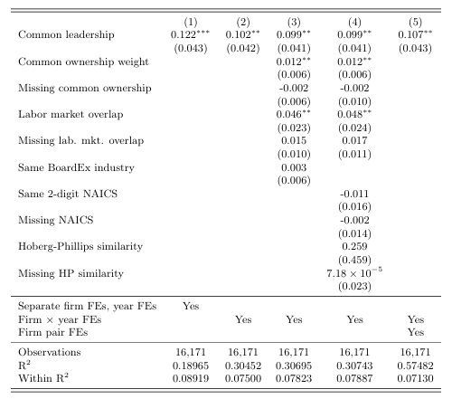

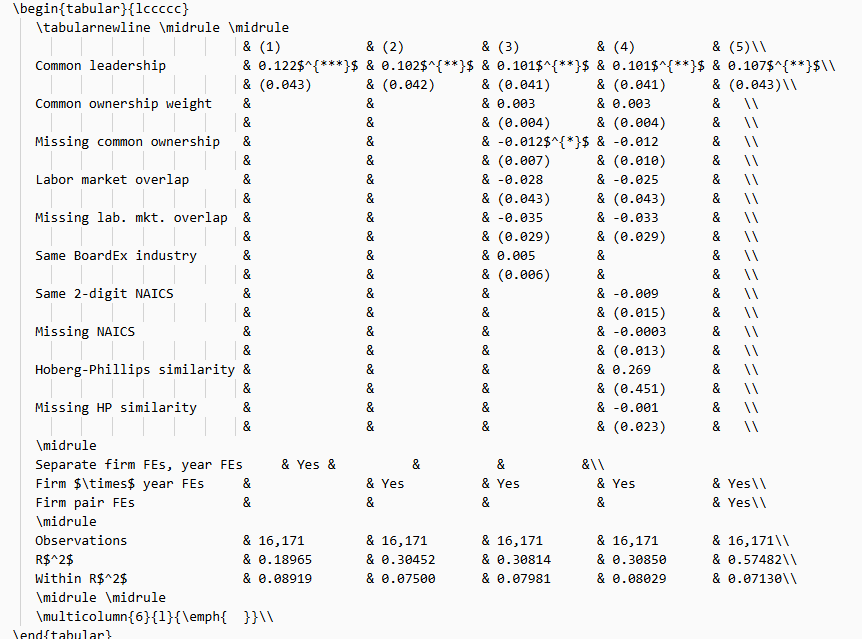

Table 2
:::

-   Discrepancies in Table 3 (see figure below).

::: {#tab-3 layout-ncol="2"}
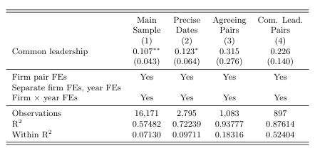

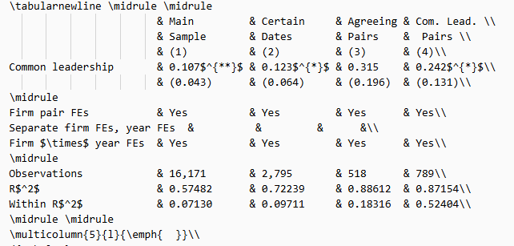

Table 3
:::

-   Discrepancies in Figure A5 (see figure below).

::: {#fig-a5 layout-ncol="2"}
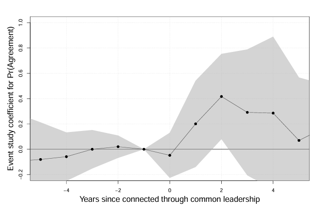

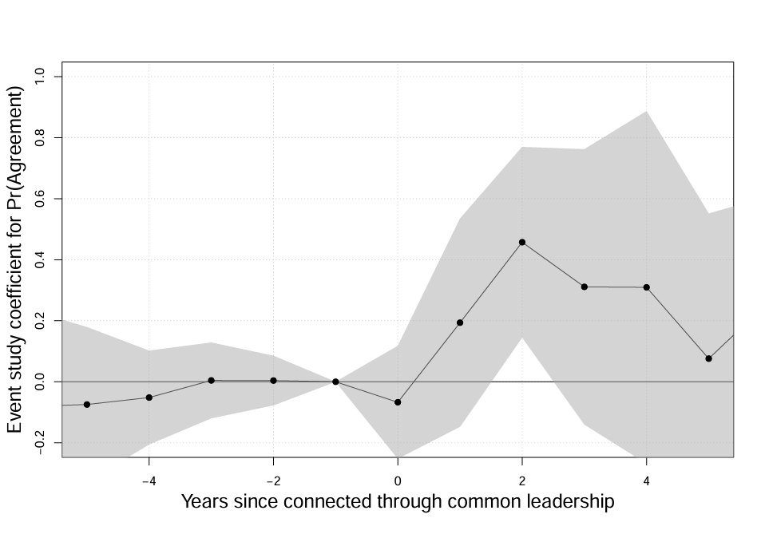

Figure A5
:::

-   Discrepancies in Table A2 (see figure below).

::: {#tab-a2 layout-ncol="2"}
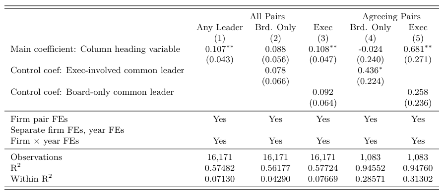

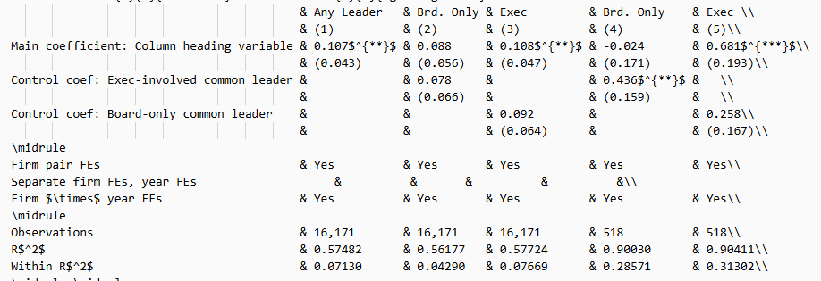

Table A2
:::

-   Discrepancies in Table B2 (see figure below).

::: {#tab-b2 layout-ncol="2"}
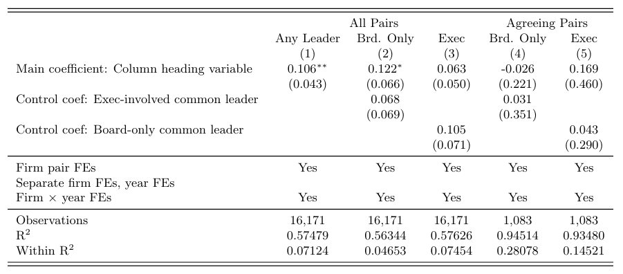

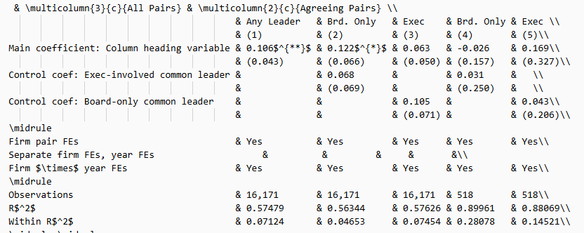

Table B2
:::

-   Discrepancies in Table C2, Labor market overlap row (see figure below).

::: {#tab-c2 layout-ncol="2"}
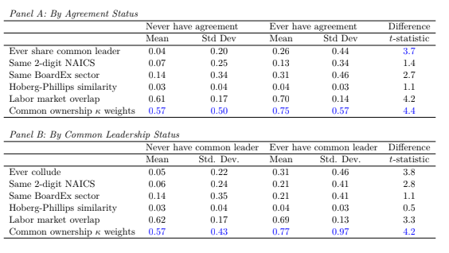

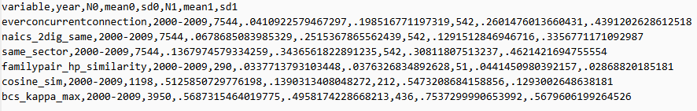

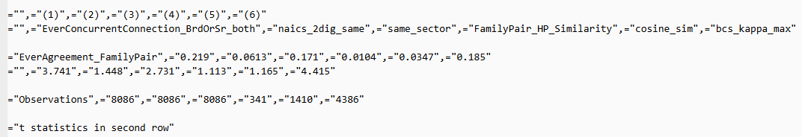

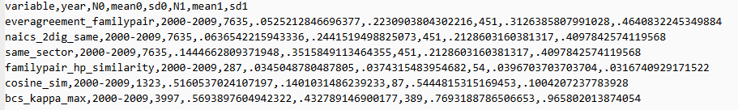

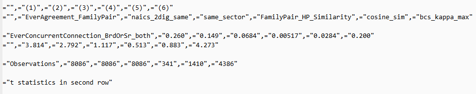

Table C2
:::

- Table 1 was not reproduced.
- Note that the manuscript should be updated with the new outputs as per `JPE_replication_response_v2_260501.pdf`. The current one still includes the earlier versions.

## In-Text Numbers

-   [x] In-text numbers not verified.

-   [ ] There are no in-text numbers, or all in-text numbers stem from tables and figures.

-   [ ] There are in-text numbers, but they are not identified in the code

-   `table_agreement_counts_family_level.txt` not reproduced. `connection_agreement_crosstab.csv` produces 813, 42, 32, 15 instead of 815, 57 and 47.

# Classification

-   [ ] full reproduction
-   [ ] full reproduction with minor issues
-   [x] partial reproduction (see above)
-   [ ] not able to reproduce most or all of the results (reasons see above)

## Reason for incomplete reproducibility

-   [ ] None.
-   [x] `Discrepancy in output` (either figures or numbers in tables or text differ)
-   [ ] `Bugs in code` that were fixable by the replicator (but should be fixed in the final deposit)
-   [ ] `Code missing`, in particular if it prevented the replicator from completing the reproducibility check
    -   [ ] `Data preparation code missing` should be checked if the code missing seems to be data preparation code
-   [ ] `Code not functional` is more severe than a simple bug: it prevented the replicator from completing the reproducibility check
-   [ ] `Software not available to replicator` may happen for a variety of reasons, but in particular (a) when the software is commercial, and the replicator does not have access to a licensed copy, or (b) the software is open-source, but a specific version required to conduct the reproducibility check is not available.
-   [ ] `Insufficient time available to replicator` is applicable when (a) running the code would take weeks or more (b) running the code might take less time if sufficient compute resources were to be brought to bear, but no such resources can be accessed in a timely fashion (c) the replication package is very complex, and following all (manual and scripted) steps would take too long.
-   [ ] `Data missing` is marked when data *should* be available, but was erroneously not provided, or is not accessible via the procedures described in the replication package
-   [ ] `Data not available` is marked when data requires additional access steps, for instance purchase or application procedure.
-   [ ] `Missing README` is marked if there is no README to guide the replicator, or the README is not in compliance with JPE requirements
