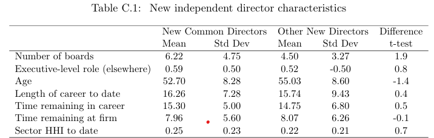
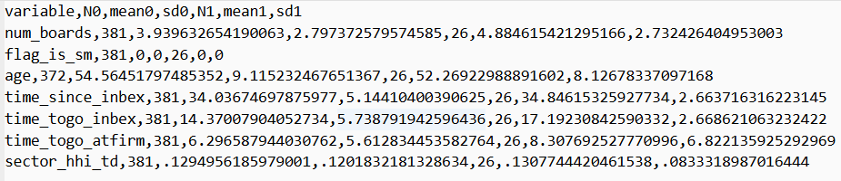
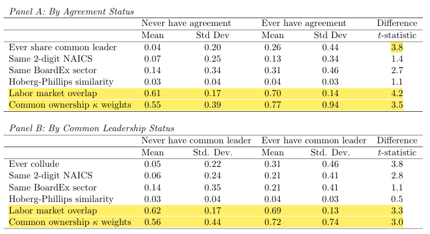
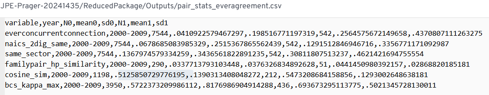
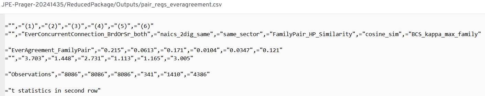
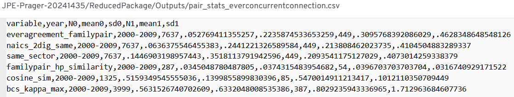
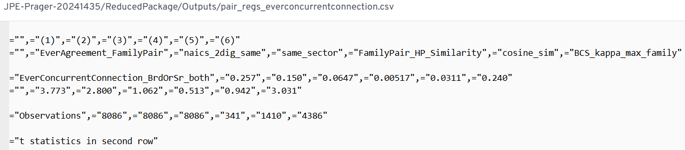

# Paper Identification

|           |                      |
|-----------|----------------------|
| ID        |  |
| Author    |    |
| Title     |     |
| Iteration |     |

Some useful information up front:

-   [JPE Data and Code Availability Policy](https://www.journals.uchicago.edu/journals/jpe/datapolicy)
-   [Step by step guidance from Data Editor for Authors](https://jpedataeditor.github.io/)
-   [Template README](https://social-science-data-editors.github.io/template_README/)

# Summary

In assessing compliance with our [Data and Code Availability Policy](https://www.journals.uchicago.edu/journals/jpe/datapolicy), our reproducibility team has identified the following issues, which we ask you to address:

# General

-   [x] Data Availability and Provenance Statements
    -   [x] Statement about Rights - Part 1: Right to use the data (e.g. *did the authors lawfully obtain the data*)
    -   [x] Statement about Rights - Part 2: Right to publish the data (e.g. *are human subjects involved and did permission been granted to publish their data?*)
    -   [ ] License for Data (optional, but recommended)
    -   [x] Details on each Data Source
-   [x] Dataset list
-   [x] Computational requirements
    -   [x] Software Requirements
    -   [ ] Controlled Randomness (as necessary)
    -   [x] Memory, Runtime, and Storage Requirements
-   [x] Description of programs/code
    -   [ ] License for Code (Optional, but recommended)
-   [x] List of tables and programs
-   [x] References (Optional, but recommended)

# High-level Description of Research Project

*This research project...*

-   [x] uses observational data.
-   [x] uses *confidential* observational data.
-   [ ] uses data generated via experiment or trial by the authors (in field or lab).
    -   [ ] For lab experiments: The code to implement the experimental protocol (z-Tree, o-Tree etc) is included in the package.
    -   [ ] A PDF copy of IRB approval is contained in the package.
    -   [ ] A PDF document outlining the design of the experiment, including information on the selection and eligibility of participants is included.
    -   [ ] A PDF copy of the instructions given to participants in both original language and an English translation is included.
-   [ ] uses data generated via survey by the authors (in field or online)
    -   [ ] The programs used to administer the survey (e.g. qualtrics survey file) are included.
    -   [ ] A PDF copy of IRB approval is contained in the package.
    -   [ ] A PDF of the original questionaire(s) and information on the selection and eligibility of participants is included.
-   [ ] is a simulation study: the data are generated by an algorithm.
-   [ ] is a numerical illustration: no data are used but code is used to produce illustrative output (tables, figures)

# Data description

For any data that cannot be provided as part of the replication package, please provide the following information as part of the README.

> {REQUIRED} Please specify how long the data will be preserved in the restricted-access location.

> {REQUIRED} Please provide affirmation of support for replication checks. - As per the [JPE policy](https://jpedataeditor.github.io/policy.html), "In cases where data cannot be published in an openly accessible trusted data repository like the JPE dataverse, authors who have requested an exemption to publish them at the time of first submission must commit to preserving the data and code for a period of no less than five years following the publication of the paper. They should also provide reasonable assistance to requests for clarification and replication."

> {REQUIRED} Please provide a codebook for the data. - The codebook should at a minimum describe the variables obtained from the data source, in a manner that will let others verify that they have obtained a substantially similar dataset if successfully obtaining access to the data.

## Data Sources

| file/name | public | private | DOI/URL | Access described | cited readme | cited paper |
|-----------|-----------|-----------|-----------|-----------|-----------|-----------|
| agreement_timing_spring2023version.csv | yes | no | \- | yes | yes | yes |
| public_scrape_kappas_1999–2017.parquet | no | yes | no | yes | yes | yes |
| tnic3_data.txt | \- | \- | yes | yes | yes | yes |
| BoardEx (NA files / wrds_boardex_na.csv) | no | yes | yes | yes | yes | no |
| wrds_boardex_compustat_link.csv | no | yes | yes | yes | yes | no |
| crsp_compustat_annual_2000_2019.dta | no | yes | yes | yes | yes | no |
| linkedin_raw.csv (BrightData / Ge et al.) | no | yes | no | yes | yes | yes |

## 1. Panel of No-Poaching Agreements (agreement_timing_spring2023version.csv)

-   [x] Dataset is provided in public deposit
-   [ ] Dataset is PRIVATELY provided (not for publication)
-   [ ] DOI or URL is provided, and works
-   [x] Access conditions are described:
    -   Provided directly with the replication package under `/Data/Input/Lawsuit and Agreements/`.
-   [ ] Data are not cited, but a working paper, article, or other document is cited (not a data citation)
-   [x] Data are cited
    -   [x] in the manuscript
    -   [x] in the README:
    \> Herrera-Caicedo, Alejandro, Jessica Jeffers, and Elena Prager (Accepted). "Collusion Through Common Leadership." *Journal of Political Economy*.

## 2. Kappa Weights for Common Ownership (public_scrape_kappas_1999–2017.parquet)

-   [ ] Dataset is provided in public deposit
-   [x] Dataset is PRIVATELY provided (not for publication)
    -   Shared privately with the data editor for the purpose of replication.
-   [ ] DOI or URL is provided, and works
    -   No DOI. Contact provided: michael.sinkinson\@kellogg.northwestern.edu
-   [x] Access conditions are described:
    -   Available on request from Backus et al. (2021).
-   [ ] Data are not cited, but a working paper, article, or other document is cited (not a data citation)
-   [x] Data are cited
    -   [x] in the manuscript
    -   [x] in the README:
    \> Backus, Matthew, Christopher Conlon, and Michael Sinkinson (2021). "Common Ownership in America: 1980–2017." *American Economic Journal: Microeconomics*, Vol. 13, No. 3, pp. 273–308.

## 3. Text-Based Network Industry Classifications (tnic3_data.txt)

-   [ ] Dataset is provided in public deposit
-   [ ] Dataset is PRIVATELY provided (not for publication)
-   [x] DOI or URL is provided, and works: https://hobergphillips.tuck.dartmouth.edu/
-   [x] Access conditions are described:
    -   Publicly downloadable from the authors' website.
-   [ ] Data are not cited, but a working paper, article, or other document is cited (not a data citation)
-   [x] Data are cited
    -   [x] in the manuscript
    -   [x] in the README:
    \> Hoberg, Gerard and Gordon Phillips (2016). "Text-Based Network Industries and Endogenous Product Differentiation." *Journal of Political Economy*, Vol. 124, No. 5, pp. 1423–1465.

## 4. BoardEx (NA files / wrds_boardex_na.csv / wrds_boardex_compustat_link.csv)

-   [ ] Dataset is provided in public deposit
-   [x] Dataset is PRIVATELY provided (not for publication)
    -   Shared privately with the data editor for the purpose of replication.
-   [x] DOI or URL is provided, and works:
    -   Direct: https://boardex.com/
    -   Via WRDS: https://wrds-www.wharton.upenn.edu/pages/about/data-vendors/boardex/
-   [x] Access conditions are described:
    -   Commercial subscription required, either directly from BoardEx or via the WRDS platform.
-   [x] Data are not cited, but a working paper, article, or other document is cited (not a data citation)
    -   No citation of any kind in the manuscript.
-   [ ] Data are cited
    -   [ ] in the manuscript
    -   [ ] in the README

## 5. Compustat (crsp_compustat_annual_2000_2019.dta)

-   [ ] Dataset is provided in public deposit
-   [x] Dataset is PRIVATELY provided (not for publication)
    -   Shared privately with the data editor for the purpose of replication.
-   [x] DOI or URL is provided, and works: https://wrds-www.wharton.upenn.edu/pages/grid-items/compustat-annual-updates-fundamentals-annual-demo/
-   [x] Access conditions are described:
    -   Commercial/institutional subscription to WRDS required. Full CRSP-Compustat annual dataset, years 2000–2019.
-   [x] Data are not cited, but a working paper, article, or other document is cited (not a data citation)
    -   No citation of any kind in the manuscript.
-   [ ] Data are cited
    -   [ ] in the manuscript
    -   [ ] in the README

## 6. Scraped LinkedIn Profiles (linkedin_raw.csv — BrightData / Ge et al.)

-   [ ] Dataset is provided in public deposit
-   [x] Dataset is PRIVATELY provided (not for publication)
    -   Authors are not authorized to share the original data. Synthetic data in the same format are provided in the replication package as a substitute. Results from analyses using the labor market overlap measure will not match the manuscript when using the synthetic data.
-   [ ] DOI or URL is provided, and works
    -   No DOI. Contact points provided: https://brightinitiative.com/ (BrightData) and https://sites.google.com/site/iplpng/ (Ivan Png / Ge et al.).
-   [x] Access conditions are described:
    -   Requires separate requests to BrightData (via the Bright Initiative) and Ivan Png; access is not guaranteed.
-   [ ] Data are not cited, but a working paper, article, or other document is cited (not a data citation)
-   [x] Data are cited
    -   [x] in the manuscript
    -   [x] in the README (Ge et al. component only; BrightData scrape has no associated citation):
    \> Ge, Chunmian, Ke-Wei Huang, and Ivan P. L. Png (2016). "Engineer/scientist careers: Patents, online profiles, and misclassification bias." *Strategic Management Journal*, Vol. 37, No. 1, pp. 232–253.

# Requirements

-   [x] README is in TXT, MD, or PDF format
-   [x] README is accessible at the root of the package (not inside a folder)
-   [ ] Title conforms to guidance (starts with "Data and Code for: Title of Paper" or "Code for: Title of Paper", is properly capitalized)
-   [ ] Authors (with affiliations) are listed in the same order as on the paper

> {REQUIRED} Please review the title of the deposit as per our guidelines.

> {REQUIRED} Please review authors and affiliations on the deposit. In general, they are the same, and in the same order, as for the manuscript; however, authors can deviate from that order.

## Stated Requirements

-   [ ] No requirements specified
-   [x] Software Requirements specified as follows:
    -   3.1.1 Stata Version: 17 Packages: estout version 3.24, as of April 30 2021. The package can be installed using the code `ssc install estout`.
    -   3.1.2 Python Version: anaconda3/2023.07-2 Packages: No additional packages were used beyond those native to the Anaconda 3 distribution.
    -   3.1.3 R Version: 4.1.1 Packages: The following R packages were used. Each item in this list is one package, with the package version indicated as packagename_version after the underscore. The master code file includes code for installing (current versions of) these packages. `wordnet_0.1-17` `stringdist_0.9.8` `tm_0.7-8` `NLP_0.2-1` `quanteda_3.2.1` `stringi_1.7.12` `doParallel_1.0.17` `iterators_1.0.14` `foreach_1.5.2` `lubridate_1.8.0` `xml2_1.3.3` `haven_2.4.3` `DIDmultiplegtDYN_1.0.15` `did_2.1.2` `bacondecomp_0.1.1` `fixest_0.11.2` `coxme_2.2-18.1` `bdsmatrix_1.3-4` `timereg_2.0.2` `lfe_2.9-0` `Matrix_1.6-4` `survival_3.7-0` `gridExtra_2.3` `hrbrthemes_0.8.0` `openxlsx_4.2.5.2` `forcats_0.5.1` `dplyr_1.1.4` `purrr_1.0.2` `readr_2.1.2` `tidyr_1.3.1` `tibble_3.2.1` `ggplot2_3.5.1` `tidyverse_1.3.1` `plyr_1.8.6` `readxl_1.3.1` `stringr_1.5.0` `zoo_1.8-10` `bit64_4.0.5` `bit_4.0.5` `data.table_1.14.2`
-   [x] Computational Requirements specified as follows:
    -   The code was last run on a Linux server with 32 cores and 768GB of RAM. The code relies on no to minimal parallelization. Approximately 600GB of free space is required, including the space needed to save the replication packet and the additional data received from the data sources in Section 2.3. The free space requirement rises to approximately 1.5TB if including raw LinkedIn data rather than relying on the simulated LinkedIn data provided in the replication packet.
-   [x] Time Requirements specified as follows:
    -   Computation took approximately 24 hours. Approximately 16 hours of the total runtime is accounted for by a single code file, `/Code/Public Firms/public_firms_sumstats.do`, which produces Table 2.
-   [x] Requirements are complete.

# Analyzing Data and Code Files











## Code description

The replication package contains code in three languages: four Stata `.do` files, nine R `.R` files, and one Python `.py` file, plus a master Stata file and a master R file that call the others in sequence. The workflow runs in three stages: first a Stata batch (data import and crosswalks), then the full R pipeline (BoardEx panel construction, LinkedIn processing, and regression analysis), then a final Stata batch (summary statistics and balance tables).

All figures, tables, and in-text numbers were successfully mapped to a specific program and line number, with two exceptions: Figure 1 and Figures D1–D4 are court screenshots and have no associated code.



-   [x] The replication package contains a "main" or "master" file(s) which calls all other auxiliary programs.

> NOTE: In-text numbers that reference numbers in tables do not need to be listed. Only in-text numbers that correspond to no table or figure need to be listed.

## Computing Environment of the Replicator

-   MacBook Air (Intel) **OS**: macOS 14.5.0 (Darwin 24.5.0)

-   Stata 19.5

-   R 4.5.2

-   Python 3.13.12

# Replication

-   Ran code as per README.

-   Had to install undocumented Stata package `mdesc`:

    ``` stata
    ssc install mdesc
    ```

-   The README does not specify the Python version used for the virtual environment.

-   Had to install undocumented Python packages:

    ```         
    pip install pyarrow fastparquet scikit-learn openpyxl
    ```

-   `2_Get Kappas for BoardEx.py` caused the application to restart and could not be fully run.

-   All files named `boardex_connections_construct_v5_*.R` failed with the following error due to a space in the file path of `NA - Company Network - Augmented - subset 1990.csv`:

    ``` r
    Taking input= as a system command because it contains a space ('/files/JPE-Prager-20241435/ReducedPackage/Data/Output/BoardEx_analysis/NA - Company Network - Augmented - subset 1990.csv'). If it's a filename please remove the space, or use file= explicitly. A variable is being passed to input= and when this is taken as a system command there is a security concern if you are creating an app, the app could have a malicious user, and the app is not running in a secure environment; e.g. the app is running as root. Please read item 5 in the NEWS file for v1.11.6 for more information and for the option to suppress this message.
    sh: 1: /files/JPE-Prager-20241435/ReducedPackage/Data/Output/BoardEx_analysis/NA: not found
    Error in fread(paste0(dirbex, "/NA - Company Network - Augmented - subset 1990.csv")) : 
      External command failed with exit code 127. This can happen when the disk is full in the temporary directory ('/tmp/RtmpmpAsRq'). See ?fread for the tmpdir argument.
    In addition: Warning message:
    In (if (.Platform$OS.type == "unix") system else shell)(paste0("(",  :
      error in running command
    ```

-   Had to install undocumented R package `hrbrthemes` via a non-standard method, as it is no longer available on CRAN:

    ``` r
    install.packages("remotes")
    remotes::install_git("https://codeberg.org/hrbrmstr/hrbrthemes.git")
    ```

-   Running `collusion_connections_regs_v7_replication.R` failed with the following error:

    ``` r
    Error in `[.data.table`(cnx_bal_firm, Agreement == 1, AgreementType_Notes) : 
      j (the 2nd argument inside [...]) is a single symbol but column name 'AgreementType_Notes' is not found. If you intended to select columns using a variable in calling scope, please try DT[, ..AgreementType_Notes]. The .. prefix conveys one-level-up similar to a file system path.
    In addition: Warning messages:
    1: In rgl.init(initValue, onlyNULL) : RGL: unable to open X11 display
    2: 'rgl.init' failed, will use the null device.
    See '?rgl.useNULL' for ways to avoid this warning.
    ```

-   Had to replace `../..` with `$dirbase` in all do files inside `Code/BroadEx Connections/`, as the relative paths were broken.

# Findings {#sec-findings}

## Missing Requirements

-   [x] Software Requirements
    -   [x] Stata
        -   `mdesc` (undocumented, not listed in README)
    -   [x] R
        -   `hrbrthemes` (undocumented, not listed in README; no longer on CRAN, must be installed via `remotes::install_git("https://codeberg.org/hrbrmstr/hrbrthemes.git")`)
    -   [x] Python
        -   [x] Version (not specified in README)
        -   `pyarrow` (undocumented, not listed in README)
        -   `fastparquet` (undocumented, not listed in README)
        -   `scikit-learn` (undocumented, not listed in README)
        -   `openpyxl` (undocumented, not listed in README)

> \[REQUIRED\] Please amend README to contain complete requirements.

You can copy the section above, amended if necessary.

## Data Preparation Code

-   Program `import_boardex_na.do` could not be run, as it requires the proprietary BoardEx data (`wrds_boardex_na.csv`, `wrds_boardex_compustat_link.csv`). No output produced.

-   Program `compare_boardex_wrds.do` could not be run for the same reason. No output produced.

-   Program `clean_compustat.do` ran without error, producing `clean_compustat.dta` and `bex_cs_match.dta / bex_cs_match.csv`.

-   Program `boardex_network_data_pull_replication.R` could not be run, as it requires the proprietary BoardEx raw files. No output produced.

-   Program `boardex_connections_construct_v5_replication.R` partially ran: the crosswalk files `BoardEx_FamilyID_trackable_2025.csv` and `LinkedIn_FamilyID_trackable_2025.csv` were produced. However, the program subsequently failed with an error caused by a space in the output file path `NA - Company Network - Augmented - subset 1990.csv`, which `data.table::fread` interpreted as a system command rather than a filename:

    ``` r
    Error in fread(paste0(dirbex, "/NA - Company Network - Augmented - subset 1990.csv")) : 
      External command failed with exit code 127.
    ```

    As a result, `company_network_sample_2025.csv`, `publicFirms_Skeleton.csv`, and all downstream panel connection files were not produced.

-   Programs `boardex_connections_construct_v5_AllSrVpsIN_replication.R`, `boardex_connections_construct_v5_AllSrVpsOUT_replication.R`, and `boardex_connections_construct_v5_CSuitSubset_replication.R` all failed with the same space-in-path error. No output produced.

-   Program `1_Companyid_CUSIP_Crosswalk.do` ran without error, producing `companyid_cusip_crosswalk.dta`.

-   Program `2_Get_Kappas_for_BoardEx.py` caused the application to restart and could not be fully run. Neither `yearly_kappas_2000_2017.parquet` nor `Annual Firmpair Kappas for BoardEx 2000-2017.dta` were produced.

-   Program `individual_counts_v3_replication.R` ran without error, producing `firm_level_counts_preaggregation.csv` and `firm_level_counts.csv`.

-   Program `Leader_Panel.R` ran without error, producing `Panel_Leaders.csv`.

-   Program `Create_regression_sample_2025_bexcompanyid_familyid.do` ran without error, producing `regression_sample_2025_bexcompanyid_familyid.csv`. Required replacing `../..` with `$dirbase` in the path definitions prior to running.

-   Program `Create_Sample_Leaders.do` ran without error, producing `Sample_Leaders.csv`. Required replacing `../..` with `$dirbase` in the path definitions prior to running.

-   Program `Create_Sample_Common_Leaders.do` did not produce `Sample_Common_Leaders.csv`, as it depends on `panel_connections_by_row_company_network_NA_2025.csv`, which was not produced due to the earlier failure of `boardex_connections_construct_v5_replication.R`.

-   LinkedIn processing scripts were not provided in the replication package. A subset of their expected outputs were nonetheless present in the package (cosine distance CSVs, deduplication checkpoints, employment and flows chunks, `job_categories_gpt.csv`, `deduplication_directory_2025.csv`, `flows_annual.csv`); however, `linkedin_raw.csv` (synthetic), the ChatGPT job classification raw and processed files (0–49.csv, 0–30.xlsx), and `emp_titles_dedup.csv` were not reproduced.

-   Program `collusion_connections_regs_v7_replication.R` failed with the following error, preventing production of all downstream outputs including the regression sample, summary statistics, and all exhibit files:

    ``` r
    Error in `[.data.table`(cnx_bal_firm, Agreement == 1, AgreementType_Notes) : 
      j (the 2nd argument inside [...]) is a single symbol but column name 'AgreementType_Notes' is not found.
    ```

-   Program `public_firms_sumstats.do` did not run, as it depends on outputs from `collusion_connections_regs_v7_replication.R` that were not produced. No output produced.

-   Programs `TC1_Panel_leaders_stats.do` and `TC2_Sample_pair_and_firm_balance_tables.do` did not run, as they depend on `Sample_Common_Leaders.csv`, which was not produced. No output produced.

## Tables and Figures

-   Discrepancies in Table C1 (see figure below).

::: {#tab-c1 layout-ncol="2"}




Table C1
:::

-   Discrepancies in Table C2 (see figure below).

::: {#tab-c2 layout-ncol="2"}










Table C2
:::

-   The rest of tables and figures were not reproduced.

## In-Text Numbers

-   [x] In-text numbers not verified.

-   [ ] There are no in-text numbers, or all in-text numbers stem from tables and figures.

-   [ ] There are in-text numbers, but they are not identified in the code

-   I was not able to reproduce any of the in-text numbers.

# Classification

-   [ ] full reproduction
-   [ ] full reproduction with minor issues
-   [ ] partial reproduction (see above)
-   [x] not able to reproduce most or all of the results (reasons see above)

## Reason for incomplete reproducibility

-   [ ] None.
-   [x] `Discrepancy in output` (either figures or numbers in tables or text differ)
-   [x] `Bugs in code` that were fixable by the replicator (but should be fixed in the final deposit)
-   [ ] `Code missing`, in particular if it prevented the replicator from completing the reproducibility check
    -   [ ] `Data preparation code missing` should be checked if the code missing seems to be data preparation code
-   [ ] `Code not functional` is more severe than a simple bug: it prevented the replicator from completing the reproducibility check
-   [ ] `Software not available to replicator` may happen for a variety of reasons, but in particular (a) when the software is commercial, and the replicator does not have access to a licensed copy, or (b) the software is open-source, but a specific version required to conduct the reproducibility check is not available.
-   [ ] `Insufficient time available to replicator` is applicable when (a) running the code would take weeks or more (b) running the code might take less time if sufficient compute resources were to be brought to bear, but no such resources can be accessed in a timely fashion (c) the replication package is very complex, and following all (manual and scripted) steps would take too long.
-   [ ] `Data missing` is marked when data *should* be available, but was erroneously not provided, or is not accessible via the procedures described in the replication package
-   [ ] `Data not available` is marked when data requires additional access steps, for instance purchase or application procedure.
-   [ ] `Missing README` is marked if there is no README to guide the replicator, or the README is not in compliance with JPE requirements
